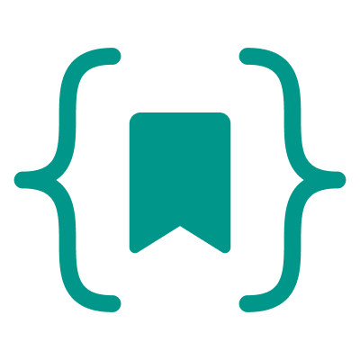

  
  <h1>CodeSave</h1>
  
A simple code snippet manager to save, organize, and share your code.

---

> 🚧 **Work in Progress**  
> CodeSave is currently under active development and not yet released. Breaking changes can be expected

## Stack

> ⚠️ The stack can change as the project is still under active development.

**Backend**
- Java (Quarkus)
- PostgreSQL
- Liquibase (migrations)

**Frontend**
- Vite
- React
- React Router
- shadcn/ui
